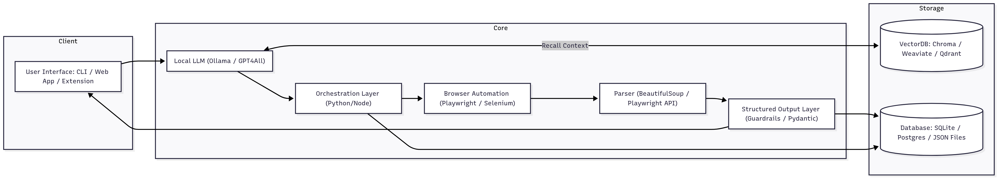

# Xtracto - Web Navigator AI Agent

## a) Problem Statement Reference

🔹 **Problem Statement Chosen:**
Build an AI Agent that can take natural language instructions and autonomously drive the web on a local computer.

🔹 **Reason to Choose the Problem Statement:**
- The intersection of local LLMs and browser automation enables secure, cloud-independent AI tools.
- Rising demand for AI personal assistants that respect user privacy and work offline.
- Offers a practical, extensible framework for automating day-to-day web tasks, especially useful for researchers, professionals, and data analysts.
- Combines multiple domains: LLMs, automation, scraping, structured output generation, and human-AI interaction.

## b) Solution Overview

🔹 **Proposed Approach:**
Develop a fully local AI agent that can understand user instructions via a Local LLM, control a browser to execute tasks (e.g., search, scrape, click), and return clean, structured outputs in JSON/CSV formats.

🔹 **Key Features / Modules:**
- User Interface (CLI / Web App / Extension)
- Instruction Parser (LLM like Ollama / GPT4All)
- Orchestration Engine (Python/Node.js)
- Browser Automation (Playwright / Selenium)
- HTML Parser & Extractor
- Structured Output Formatter
- Storage Layer (VectorDB + Local DB)
- Task Memory & Reasoning Module
- Voice Input Handler (Optional)

## c) System Architecture

🔹 **Architecture Diagram:**

🔹 **Data Flow Explanation:**
1. User Input via CLI or Web App.
2. LLM interprets natural language and returns an action plan.
3. Orchestrator processes the plan and invokes browser automation.
4. Browser navigates, searches, clicks, or scrapes as instructed.
5. Parser extracts relevant data.
6. Output Layer structures and validates the result.
7. Result is returned to user and stored locally.
8. (Optional) VectorDB recalls previous tasks and context.

## d) Technology Stack

🔹 **Backend:**
- Python with FastAPI or Node.js
- LangChain / Custom Orchestrator

🔹 **Frontend:**
- CLI (Typer)
- Web App (React + Flask / Next.js + Express)

🔹 **Databases:**
- Structured: SQLite / PostgreSQL
- Unstructured: JSON/CSV Files
- Vector Storage: Chroma / Qdrant / Weaviate

🔹 **ML/AI Frameworks:**
- Ollama (LLaMA2 / Mistral)
- GPT4All
- LangChain (Optional)

🔹 **APIs / Libraries:**
- Playwright / Selenium / Puppeteer
- BeautifulSoup / lxml / Playwright API
- Guardrails / Pydantic for validation
- OpenAI Whisper or Vosk (Voice Input)
- Pandas for CSV/JSON transformation
